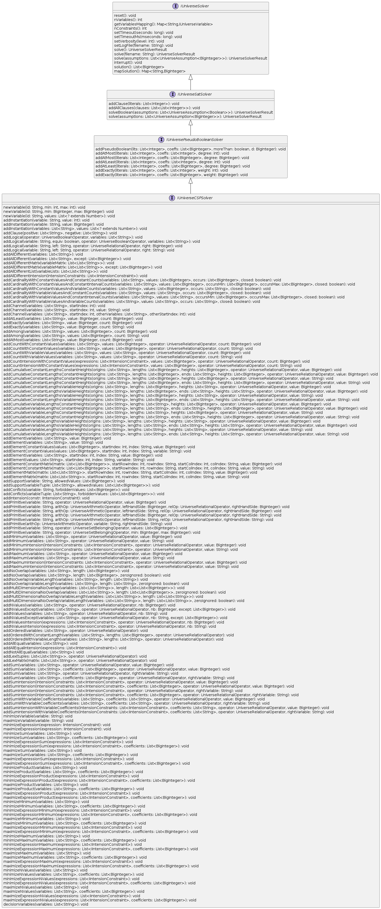
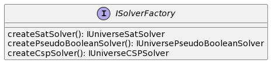

# UNIvERSE - mUlti laNguage unIfied intErface foR conStraint solvErs

| License | Linux                                                                                                                                                         & Windows | SonarCloud |
| -------- |--------------------------------------------------------------------------------------------------------------------------------------------------------------- |-------- |
| [](http://www.gnu.org/licenses/gpl-3.0)     | [](https://github.com/crillab/juniverse/actions/workflows/gradle.yml) |    |

## Description
 
`JUNIVERSE` is a `JAVA` version of [UNIVERSE](https://github.com/crillab/universe) library and proposes generic interfaces for combinatorial problems solvers. 

- [SAT Solver](src/main/java/fr/univartois/cril/juniverse/sat/IUniverseSatSolver.java)
- [PB Solver](src/main/java/fr/univartois/cril/juniverse/pb/IUniversePseudoBooleanSolver.java)
- [XCSP Solver](src/main/java/fr/univartois/cril/juniverse/csp/IUniverseCSPSolver.java) 

These interfaces are described in the following diagrams :



`Universe` offers an interface for create Solver. This interface follows the factory design pattern and is described
in the following diagrams: 



## Build

The latest release is available [here](https://github.com/crillab/juniverse/releases/latest)

`JUNIVERSE` is developed using [JAVA 10](), [Gradle 7.4.2](https://gradle.org/).
Installing Gradle is required if you want to build from source.
To do so, after having installed all the needed tools, you will need to clone
the project:

```bash
git clone https://github.com/crillab/juniverse.git
cd juniverse
gradle jar 
```
